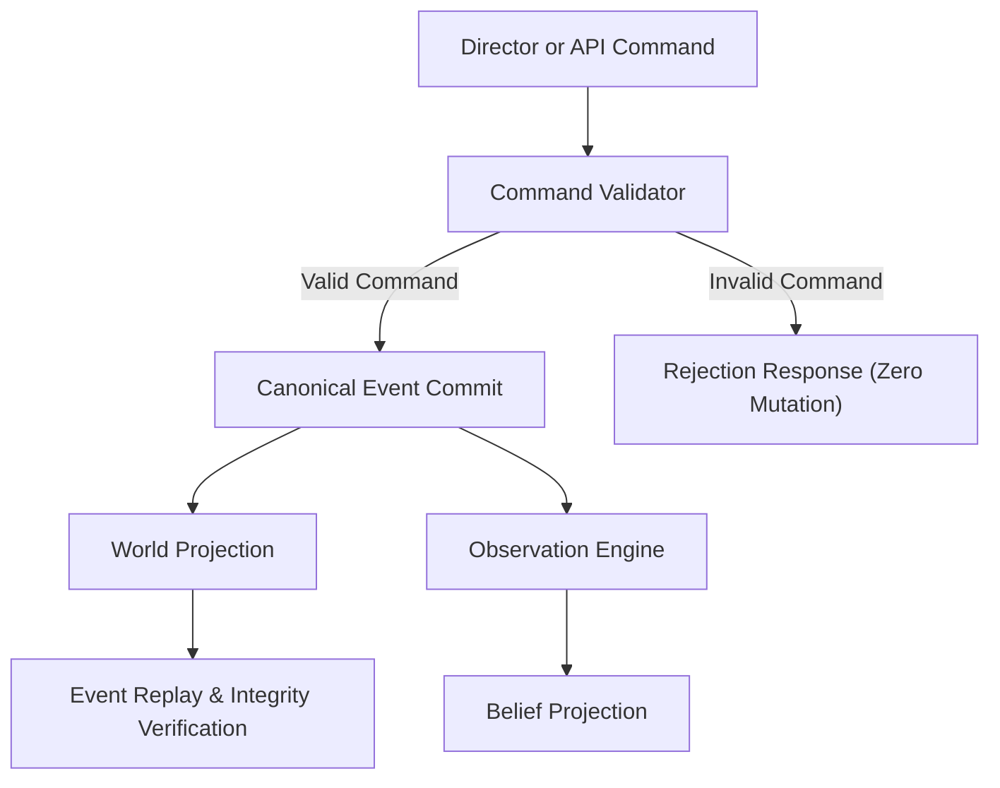

# Q-Psi Classical Engine Architecture

## Architectural Decoupling

1. **Director or API Command**: Structured command specifying actor, action, target, and parameters.
2. **Command Validator**: Evaluates physical constraints, presence, and historical commitments against canonical reality.
3. **Canonical Event Commit**: Appends event to immutable SHA-256 chained ledger.
4. **World Projection**: Updates authoritative state table.
5. **Observation Engine**: Determines spatial line-of-sight visibility for room occupants.
6. **Belief Projection**: Updates subjective character belief matrices exclusively for present observers.
7. **Event Replay**: Reconstructs state from seed + ledger to verify bit-exact digest matching.
